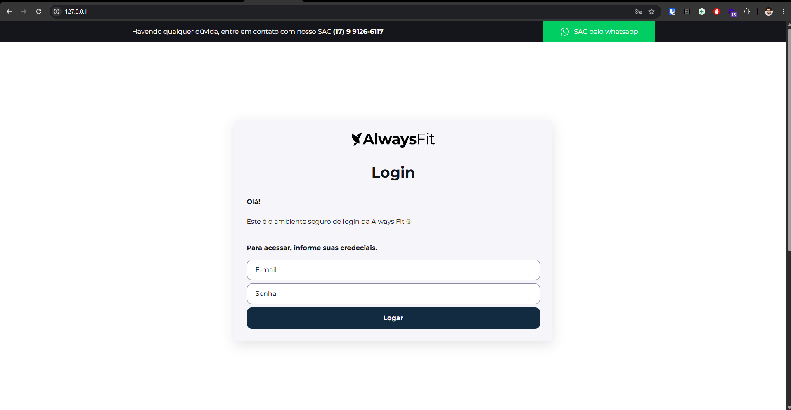
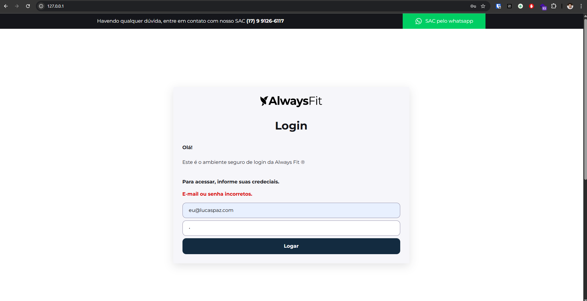
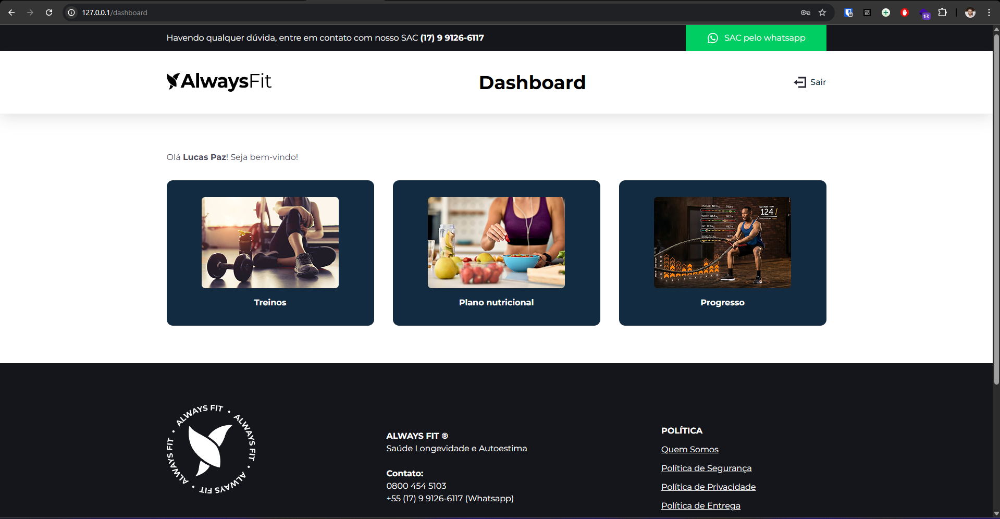
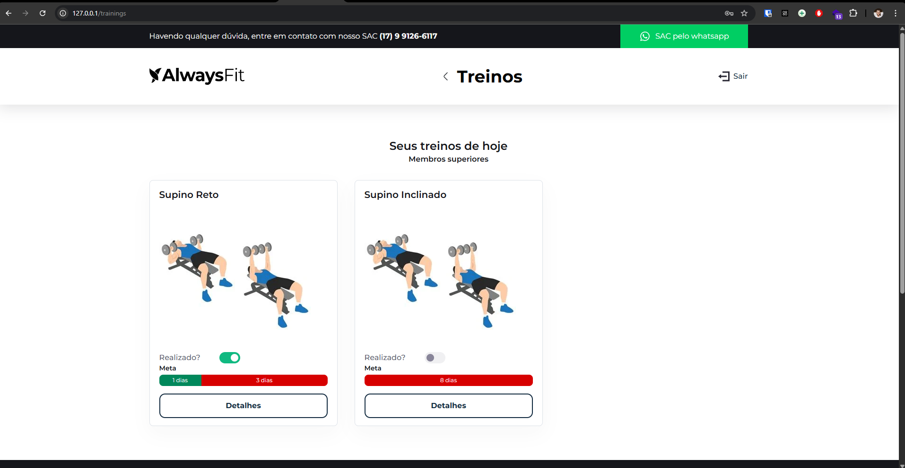
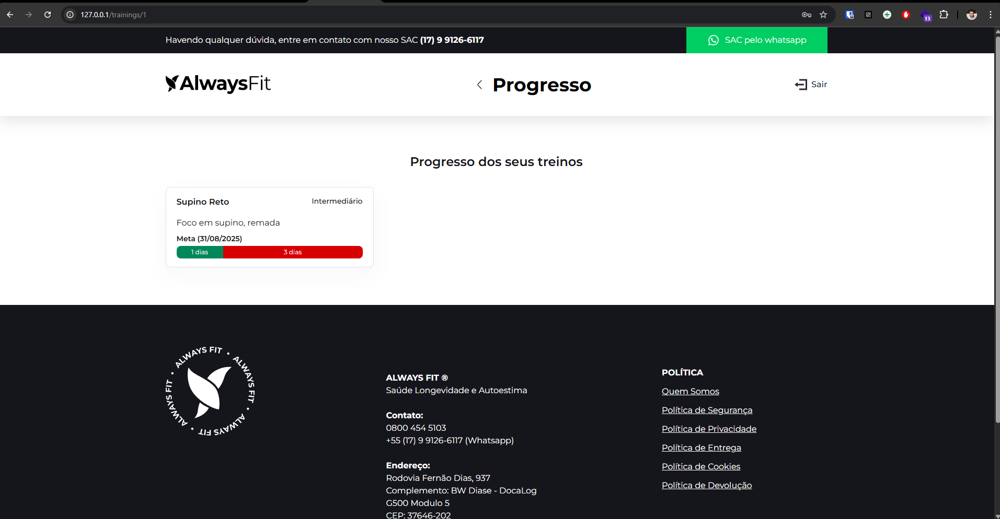
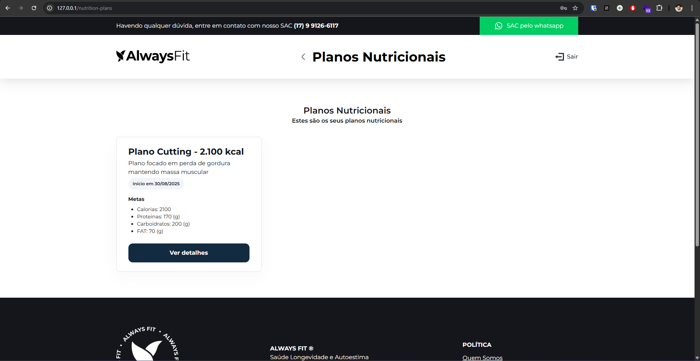
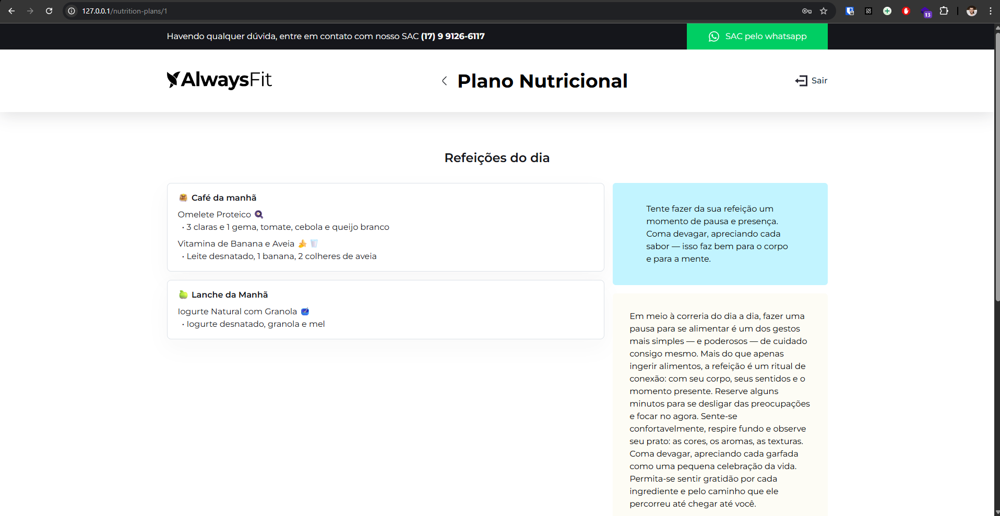
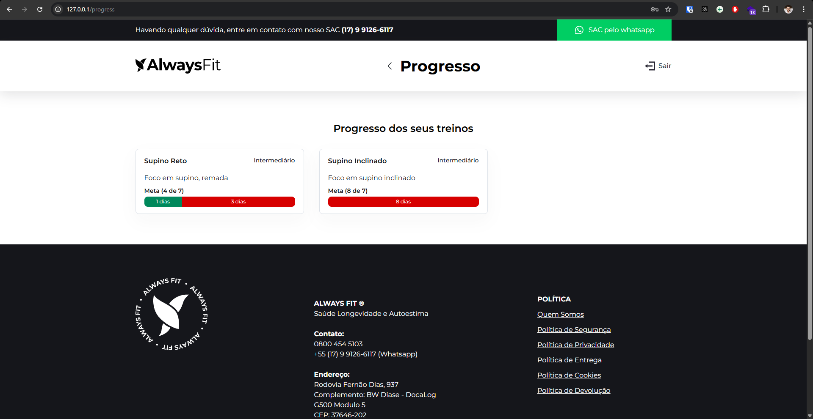

# AlwaysFit










## Manual de Configuração e Execução do Projeto

Siga os passos abaixo para configurar e executar o projeto:

### Requisitos do Projeto
- **PHP**: 8.4.12 (Certifique-se de que esta versão está instalada na sua máquina)
- **Composer**: Certifique-se de que o Composer está instalado na sua máquina para gerenciar as dependências do PHP
- **PostgreSQL**: 17
- **Laravel**: 12
- **NodeJS**: 22.19.0
- **PNPM**: 10.15.0

> **Nota:** Este projeto foi desenvolvido para ser executado utilizando Docker, garantindo que todos os serviços necessários estejam em containers. Quaisquer alterações na configuração padrão do projeto são de responsabilidade do usuário, e o autor não se responsabiliza por problemas decorrentes dessas modificações.

### Passo 1: Instalar Dependências do PHP
Execute o comando abaixo para instalar as dependências do PHP:
```bash
composer install
```

### Passo 2: Subir os Containers
Inicie os containers Docker com o comando:
```bash
sail up -d
```

### Passo 3: Instalar Dependências do Frontend
Instale as dependências do frontend utilizando o comando:
```bash
sail pnpm install
```

### Passo 4: Fazer o Build da Aplicação
Realize o build da aplicação com o comando:
```bash
sail pnpm run build
```

### Passo 5: Subir as Tabelas do Banco de Dados
Execute as migrações para criar as tabelas no banco de dados:
```bash
sail artisan migrate
```

### Passo 6: Popular o Banco de Dados com Dados de Teste
Insira dados de teste no banco de dados com o comando:
```bash
sail artisan db:seed
```

### Passo 7: Executar os Testes
Rode os testes unitários e de funcionalidade com o comando:
```bash
sail test
```

---

⛏️ Lucas Paz ([eu@lucaspaz.com](mailto:eu@lucaspaz.com))
